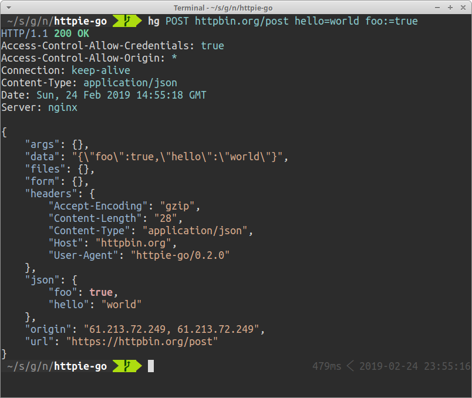

# httpie-go

[](https://circleci.com/gh/nojima/httpie-go)



**httpie-go** (`ht`) is a user-friendly HTTP client CLI.
Requests can be issued with fewer types compared to `curl`.
Responses are displayed with syntax highlighting.

httpie-go is a clone of [httpie](https://httpie.org/).
Since httpie-go is written in Go, it is a single binary and does not require a heavy runtime.

## Examples

This example sends a GET request to http://httpbin.org/get.

```bash
$ ht GET httpbin.org/get
```

The second example sends a POST request with JSON body `{"hello": "world", "foo": "bar"}`.

```bash
$ ht POST httpbin.org/post hello=world foo=bar
```

You can see the request that is being sent with `-v` option.

```bash
$ ht -v POST httpbin.org/post hello=world foo=bar
```

Request HTTP headers can be specified in the form of `key:value`.

```bash
$ ht -v POST httpbin.org/post X-Foo:foobar
```

Disable TLS verification.

```bash
$ ht --verify=no https://httpbin.org/get
```

Download a file.

```bash
$ ht --download <any url you want>
```

## Documents

Although httpie-go does not currently have documents, you can refer to the original [httpie's documentation](https://httpie.org/doc) since httpie-go is a clone of httpie.
Note that some minor options are yet to be implemented in httpie-go.

## How to build

```
make
```

For non-standard Linux system like Android [termux](https://termux.com/), use following method to avoid the DNS issue.

```
make build-termux
```
